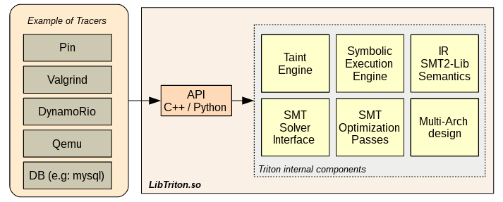
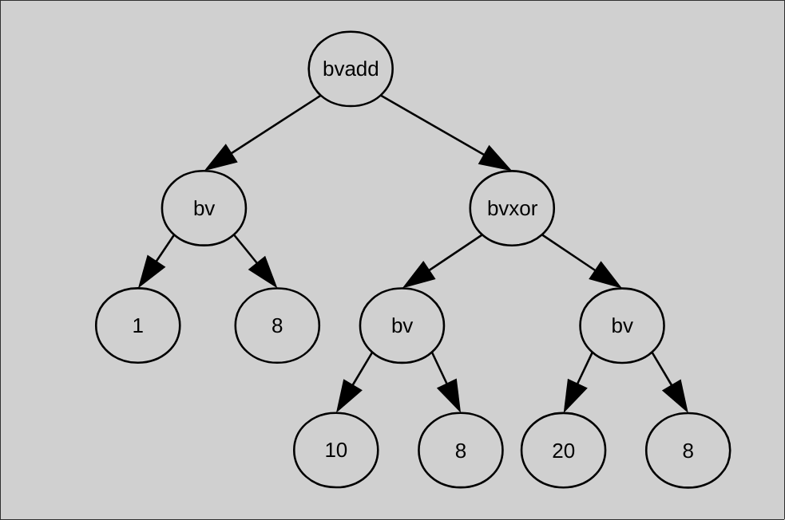

# Pimp my Triton

#### Introducing Triton and Pimp a triton based plugin for R2

###### Presented by [Ayman Khamouma](https://github.com/kamou)

irc: ak42
twitter: dsknctr

---

# Triton Overview (Who ?)
- Developed by QuarksLab's Triton Team:
   - Jonathan Salwan (Main dev)
   - Florent Saudel
   - Pierrick Brunet
   - Romain Thomas

Great / reactive support on #qb_triton !!

---

# Triton Overview (What ?)

###### 
---
# Triton Overview (continued)
**Triton** is a dynamic binary analysis framework:
- **Features**
   - Dynamic Symbolic Execution engine.
   - Taint Engine.
   - SMT solver.
   - SMT simplification passes.
   - x86/x64 instruction semantics AST Representations.
   - Tracer Interface.
   - python bindings.
   - Bonus: Pin python API

---

# Dynamic Symbolic Execution Engine

This engine maintains:

   - a table of symbolic registers states
   - a map of symbolic memory states
   - a global set of all symbolic references

---

# Ast representation
```asm
mov al, 1
mov cl, 10
mov dl, 20
xor cl, dl
add al, cl
```
---

# Ast representation
###### 

---

# Ast representation
Triton translates the x86 and the x86-64 instruction set semantics into AST representations on the
SSA form:
```
Instruction: add rax, rdx
Expressions: ref!41 = (bvadd ((_ extract 63 0) ref!40) ((_ extract 63 0) ref!39))
```
Where `ref!41` is the new expression of RAX and, `ref!40` is the previous expression of RAX, and `ref!39` is the expression of RDX

---

# Ast representation (continued)
One instruction may have more than one expression in order to handle flag semantics as well:
```
Instruction: add rax, rdx
Expressions: ref!41 = (bvadd ((_ extract 63 0) ref!40) ((_ extract 63 0) ref!39))
             ref!42 = (ite (= (_ bv16 64) (bvand (_ bv16 64) (bvxor ref!41 (bvxor ((_ extract 63 0) ref!40) ((_ extract 63 0) ref!39))))) (_ bv1 1) (_ bv0 1))
             ref!43 = (ite (bvult ref!41 ((_ extract 63 0) ref!40)) (_ bv1 1) (_ bv0 1))
             ref!44 = (ite (= ((_ extract 63 63) (bvand (bvxor ((_ extract 63 0) ref!40) (bvnot ((_ extract 63 0) ref!39))) (bvxor ((_ extract 63 0) ref!40) ref!41))) (_ bv1 1)) (_ bv1 1) (_ bv0 1))
             ref!45 = (ite (= (parity_flag ((_ extract 7 0) ref!41)) (_ bv0 1)) (_ bv1 1) (_ bv0 1))
             ref!46 = (ite (= ((_ extract 63 63) ref!41) (_ bv1 1)) (_ bv1 1) (_ bv0 1))
             ref!47 = (ite (= ref!41 (_ bv0 64)) (_ bv1 1) (_ bv0 1))
```

Two forms:
   - Z3 AST / SMT2 LIB (default)
   - Python AST (human readable)
---

# Ast representation (python)
## emulating the code:
```python
        # Build an instruction
        inst = Instruction()

        # Setup opcodes
        inst.setOpcodes(opcodes)

        # Setup Address
        inst.setAddress(addr)

        # Process everything
        processing(inst)

        # Display instruction
        print inst
        
        # Display SymbolicExpressions
        print inst.getSymbolicExpressions()
```
Demo ?

---
# SMT simplification
2 possible ways for simplifications:
  - provide simplification callbacks through ` addCallback(cb, CALLBACK.SYMBOLIC_SIMPLIFICATION)` and call `simplify(expr)`
  - ask Z3 to simplify an expressions `simplify(expr, True)`
 
Demo ?
 
---
# Constraint resolution

Just like Z3, Triton provides the ablity to generate models (inputs) based on some constraints.
--> Need symbolic variables !
### Two methods:
  - With getPathConstraints/getBranchConstraints helper function.
  - Building your own constraint.

Demo ?

---
# Constraint resolution
### Define a symbolic variable:
  - `convertMemoryToSymbolicVariable`
  - `convertRegisterToSymbolicVariable`

---
# Constraint resolution
### Building a constraint

```python
# get the symbolic expression of the register/memory
# you want to play with:
  
raxExpr = buildSymbolicRegister(REG.RAX)
memExpr = buildSymbolicMemory(
    MemoryAccess(0x00400546, 8)
)
  
# Write the constraint: 
cstr = ast.assert_(
  ast.land(
      ast.equal(raxExpr, ast.bv(42, 8)),
      ast.equal(memExpr, ast.bv(42, 4))
  )
)
 ``` 
Demo ?

---
# Constraint resolution
Triton also keeps a table of every symbolized branch it meets.
Symbolized branch: a branch instruction whos condition depends on the inputs. (IP's expression depends on the input)
`GetPathConstraints()` will return that table.
For each constraint, we'll be able to get the expression of each branch (the taken and the other one)

Demo ? 

---
# Generating a simplified / deobfuscated binary thanks to Arybo
## What is Arybo
Developped by Quarks Lab (Adrien Guinet)
A **powerfull** tool in order to manipulate expressions.

---
# Generating a simplified / deobfuscated binary thanks to Arybo
**Three simple APIs**:
 - `tritonexprs2arybo`: converts a Triton expression to Arybo Expression
 -  `tritonast2arybo`: converts a Triton symbolic variable to arybo symbolic variable
 - `to_llvm_function`: generates an llvm ir function.

Demo ?

---

# Triton in radare thanks to Pimp
https://github.com/kamou/pimp.git
`r2pm -i pimp` (ooooold version)
#### Commands:
 - pimp.init:  Initialize the Triton context (syncs registers only. Memory will be synced on demand)
 - pimp.input: Declare symbolic variables (memory only)
 - pimp.take:  Take the jump
 - pimp.avoid: Avoid the jump
 - pimp.dcusi: Continue until symbolized instruction
 - pimp.dcusj: Continue until symbolized jump
 - pimp.dcu:   Continue until address

---

# Triton in radare thanks to Pimp (demo)

---

# Future of Pimp:
 - Simplification "database".
 - Inplace simplification.
 - Opaque predicate detection and CFG modification.
 - Any ideas welcome.

---
# Questions ?
 
